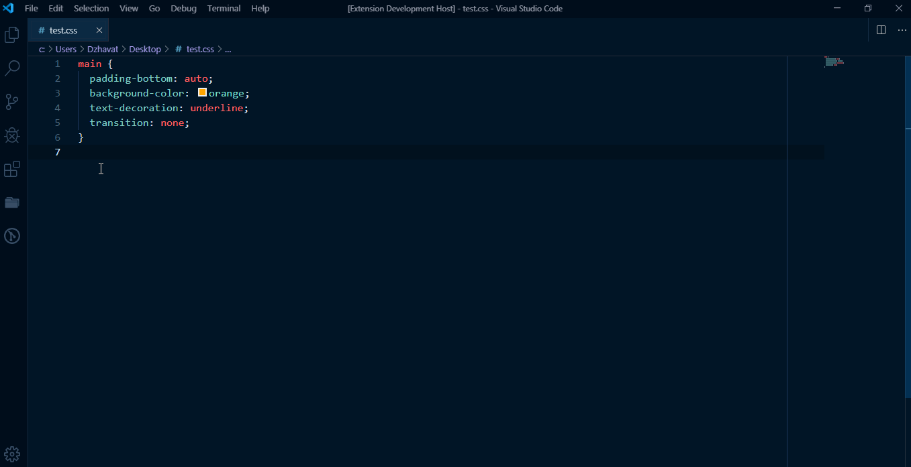

# IMPORTANT

As of [v1.38](https://code.visualstudio.com/updates/v1_38), VS Code supports the functionality provided by this extension natively as well! I’m quite happy about it because I didn’t know that they were going to implement something similar. And what’s even better is that they also show a link to MDN for HTML elements! Now go and update to the latest version of VS Code. It’s worth it! 😎

---

# CSS to MDN ([link](https://marketplace.visualstudio.com/items?itemName=dzhavat.css-to-mdn))

VS Code extension that lets you open the MDN docs of a CSS property.

## Features

Works with the following file types:

* CSS
* Less
* Sass
* Scss

## Demo

## Credit

The data used for this extension is from [MDN](https://github.com/mdn/data).
